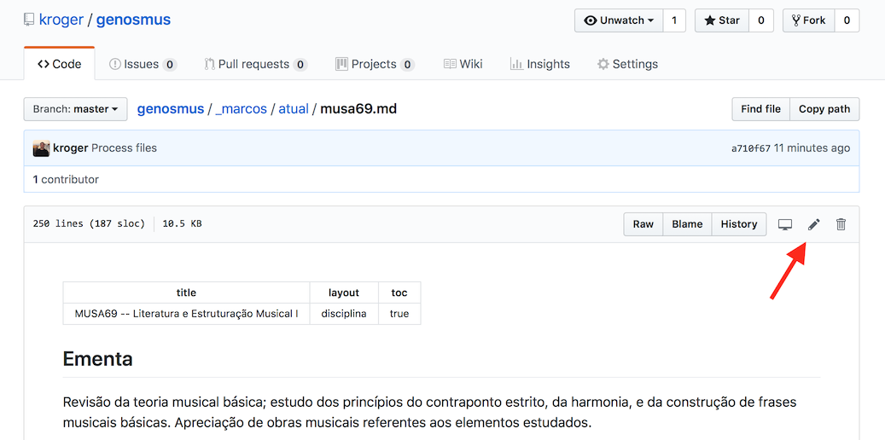

O site do [Genos](https://genosmus.com/) é desenvolvido usando o
[Jekyll](https://jekyllrb.com) e hospedado no
[Netlify](https://app.netlify.com).

## Organização

Os diretórios principais são:

- **_paginas**: As páginas principais do site como *index*, *ensino* e
  *pesquisa* estão nesse diretório

- **_marcos**: páginas com as disciplinas de Marcos. As disciplinas do
  semestre atual devem ser listadas em `_data/docentes.yml`. A lista
  das disciplinas é gerada automaticamente.

- **_pedro**: páginas com as disciplinas de Pedro. As disciplinas do
  semestre atual devem estar no diretório `_pedro`, e as disciplinas
  de semestres anteriores no diretório `anterior`. A lista das
  disciplinas é gerada automaticamente.

- **_data/docentes.yml**: dados dos docentes como email, website, e
  nome.

## Publicando Alterações no Site

O site é publicado automaticamente pelo Netlify após um `git commit`.
A maneira mais fácil de fazer uma alteração no site é editando
diretamente pela interface web do Github:

## Alterações Locais

Para modificar e visualizar o site localmente deve-se clonar o
repositório com o site e instalar o Jekyll.

1. Clone o repositório:

    git clone git@github.com:kroger/genosmus.git

2. Instale a versão mais nova do Ruby (3.0), com o homebrew:

    brew update
    brew install ruby

ou instale com com o `rbenv` (vai compilar a versão do Ruby)

	brew install rbenv
    rbenv install 3.0
	rbenv global 3.0.0
    gem install bundle

3. Instale o Jekyll e suas dependências com o comando abaixo (no
   diretório com o código do site):

  cd genosmus
	bundle install

4. Rode `make` para inicar o servidor local do Jekyll. O site deve
   estar disponível em [http://127.0.0.1:4000](http://127.0.0.1:4000).
   Esse comando vai executar `bundle exec jekyll serve`. Outros
   comando do Jekyll podem ser executados dessa maneira, como `bundle
   exec jekyll clean`, etc.

## Configuração no Netlify

A versão mais nova do Ruby disponível no Netlify é 2.6.2, enquanto a
versão mais nova disponível (e que eu uso localmente para
desenvolvimento) é 3.0.0.

Uma opção seria usar `.ruby-version` mas para não ter que manter duas
versões de Ruby localmente apenas para rodar esse site, o mais fácil é
configurar a versão de Ruby na interface do Netlify. Em "Build &
Deploy -> Environment -> Environment variables" e criar a variável
`RUBY_VERSION` com valor `2.6.2`.

## Email

O email do genos é genos@genosmus.com e pode ser acessado em
https://mail.zoho.com/zm/
